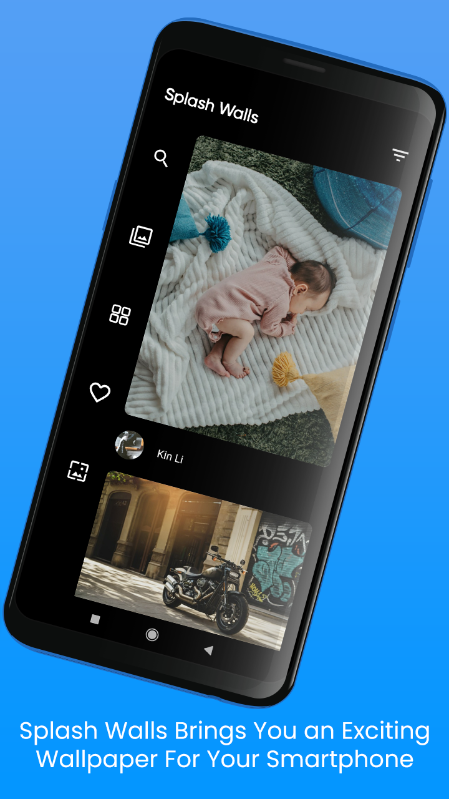

# Wallpapers

An wallpaper application that uses unsplash API in backend.

## Some feature listed over here:
<ul>
<li> Auto Wallpaper Changer </li>
<li> Contributor Collections </li>
<li> Search by categories. </li>
</ul>

## Screenshots

## Social Media

